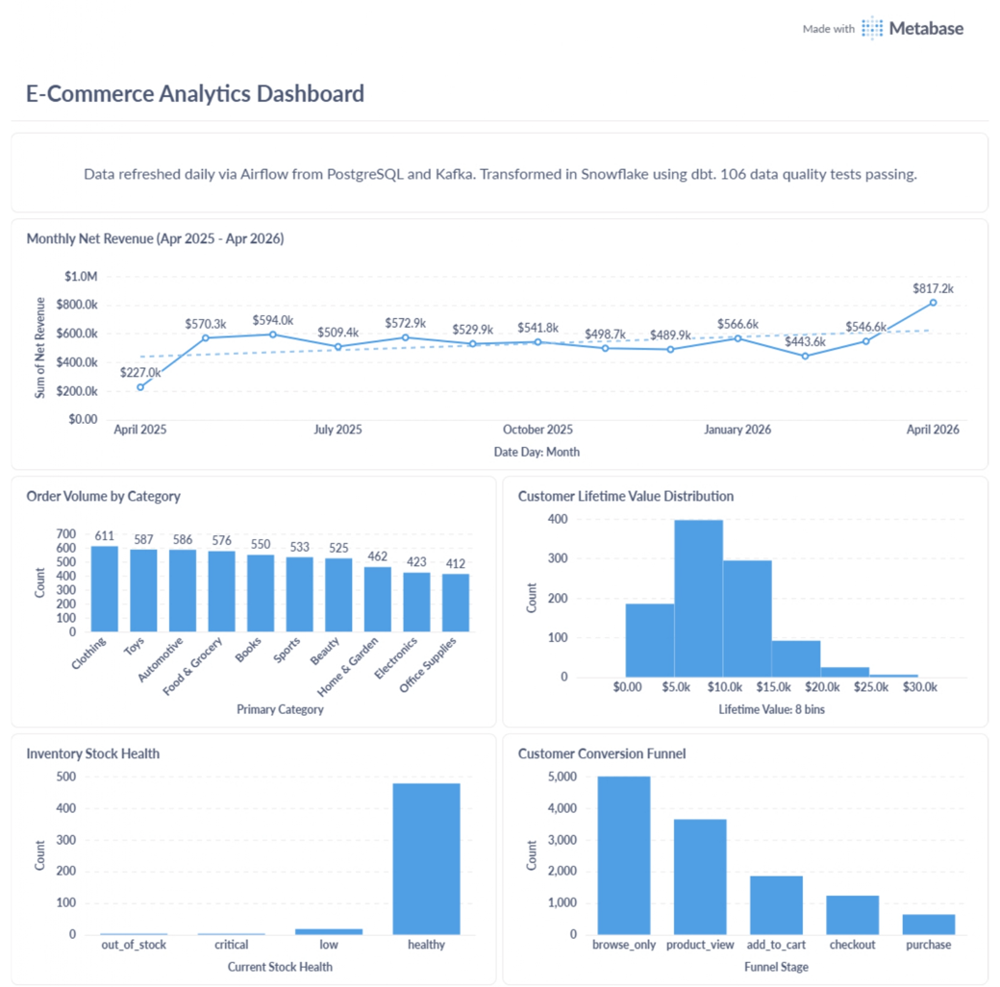
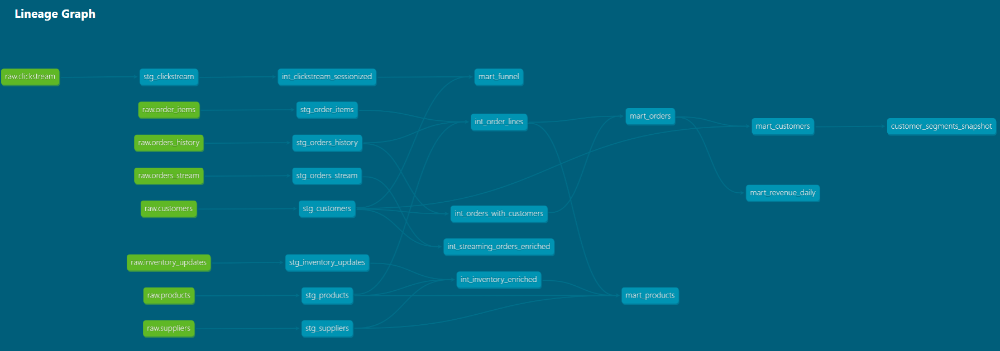
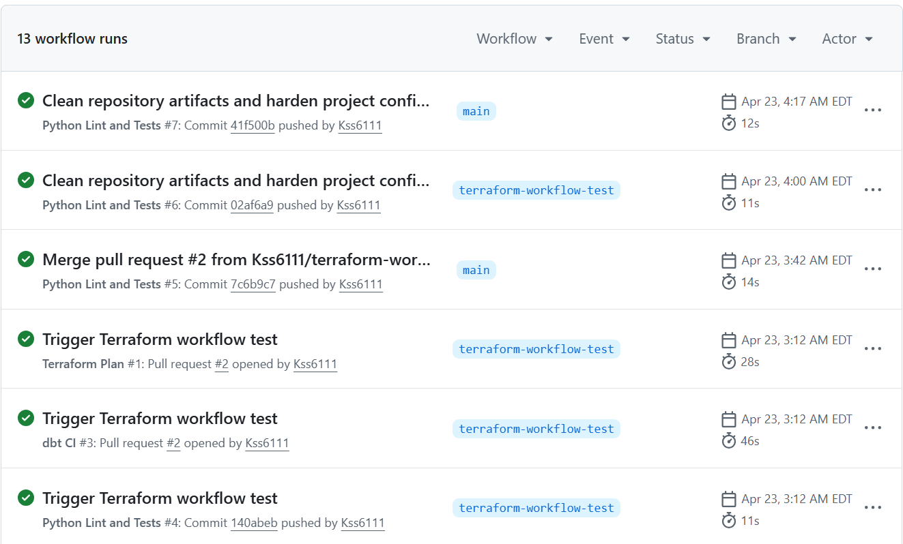

# E-Commerce Data Platform

An end-to-end data engineering platform that handles real-time event streaming and batch ingestion within a single architecture. Order events, clickstream data, and inventory updates flow through Kafka into Spark Structured Streaming, landing in Delta Lake on AWS S3. Operational data from PostgreSQL is batch-extracted to S3 on a daily schedule. Airflow orchestrates both pipelines. dbt transforms raw Snowflake data through staging and intermediate layers into business-ready mart models. Great Expectations validates data quality before it reaches the warehouse. Metabase serves the analytics dashboard.

---

## Tech Stack

| Layer | Tool |
|-------|------|
| Event streaming | Apache Kafka + Zookeeper |
| Stream processing | Spark Structured Streaming |
| Batch processing | PySpark |
| Orchestration | Apache Airflow |
| Data lake | AWS S3 |
| Table format | Delta Lake |
| Operational database | PostgreSQL |
| Data warehouse | Snowflake |
| Transformation | dbt Core |
| Data quality | Great Expectations + dbt tests |
| Infrastructure as code | Terraform |
| CI/CD | GitHub Actions |
| Visualization | Metabase |
| Data simulation | Python Faker |
| Containerization | Docker + Docker Compose |

---

## Dashboard



---

## Architecture

```
                         SOURCES
          ┌──────────────────────────────────┐
          │  PostgreSQL (operational DB)      │
          │  customers, products, suppliers   │
          │  orders_history, order_items      │
          └─────────────┬────────────────────┘
                        │ batch extract (incremental)
                        │ PySpark + boto3
                        ▼
          ┌─────────────────────────────────────────────────────┐
          │                  AWS S3 DATA LAKE                   │
          │                                                     │
          │  raw/postgres/        raw/kafka/                    │
          │  ├── customers/       ├── orders_stream/  (Delta)   │
          │  ├── products/        ├── clickstream/    (Delta)   │
          │  ├── suppliers/       └── inventory_updates/ (Delta)│
          │  ├── orders_history/                                │
          │  └── order_items/     (Parquet, date-partitioned)   │
          └──────────────────────┬──────────────────────────────┘
                                 │
          ┌──────────────────────┘
          │
          │         STREAMING PATH
          │  Python Faker (event simulator)
          │         │
          │    Apache Kafka
          │  (orders_stream, clickstream, inventory_updates)
          │         │
          │  Spark Structured Streaming
          │  (micro-batch, 30s trigger, Delta Lake output)
          │         │
          └─────────┤
                    │
                    ▼
          ┌─────────────────────────────────────────┐
          │           APACHE AIRFLOW                │
          │                                         │
          │  batch_ingestion_dag  (daily)           │
          │  streaming_load_dag   (every 30 min)    │
          │  dbt_trigger_dag      (after both load) │
          └──────────────────┬──────────────────────┘
                             │ COPY INTO
                             ▼
          ┌─────────────────────────────────────────┐
          │            SNOWFLAKE                    │
          │                                         │
          │  RAW schema      (8 tables, as-loaded)  │
          │  STAGING schema  (13 views, dbt)        │
          │  MARTS schema    (5 tables, dbt)        │
          └──────────────────┬──────────────────────┘
                             │
                             ▼
          ┌─────────────────────────────────────────┐
          │               dbt Core                  │
          │                                         │
          │  staging      light cleaning, type cast │
          │  intermediate joins, business logic     │
          │  marts        wide tables, serving layer│
          │                                         │
          │  106 tests  |  4 macros  |  1 snapshot  │
          └──────────────────┬──────────────────────┘
                             │
                             ▼
          ┌─────────────────────────────────────────┐
          │             METABASE                    │
          │  5 charts, connected to MARTS schema    │
          └─────────────────────────────────────────┘
```

---

## dbt Lineage Graph



---

## Repository Structure

```
ecommerce-data-platform/
│
├── airflow/
│   ├── dags/
│   │   ├── batch_ingestion_dag.py       # PostgreSQL -> S3 -> Snowflake RAW
│   │   ├── streaming_load_dag.py        # S3 Delta Lake -> Snowflake RAW
│   │   ├── dbt_trigger_dag.py           # Runs dbt after both loads complete
│   │   └── sql/
│   │       └── create_raw_tables.sql    # DDL for all 8 RAW tables
│   ├── Dockerfile                       # Custom image with dbt + Snowflake connector
│   └── plugins/
│
├── dbt/
│   ├── models/
│   │   ├── staging/                     # 8 staging views, one per RAW table
│   │   │   ├── stg_customers.sql
│   │   │   ├── stg_orders_history.sql
│   │   │   ├── stg_orders_stream.sql
│   │   │   ├── stg_clickstream.sql
│   │   │   ├── stg_inventory_updates.sql
│   │   │   ├── stg_order_items.sql
│   │   │   ├── stg_products.sql
│   │   │   ├── stg_suppliers.sql
│   │   │   └── sources.yml
│   │   ├── intermediate/                # 5 intermediate views
│   │   │   ├── int_order_lines.sql
│   │   │   ├── int_orders_with_customers.sql
│   │   │   ├── int_streaming_orders_enriched.sql
│   │   │   ├── int_clickstream_sessionized.sql
│   │   │   └── int_inventory_enriched.sql
│   │   └── marts/                       # 5 mart tables, final serving layer
│   │       ├── mart_orders.sql
│   │       ├── mart_customers.sql
│   │       ├── mart_products.sql
│   │       ├── mart_revenue_daily.sql
│   │       └── mart_funnel.sql
│   ├── macros/
│   │   ├── generate_schema_name.sql     # Overrides dbt schema prefixing
│   │   ├── cents_to_dollars.sql
│   │   ├── date_spine_columns.sql
│   │   └── surrogate_key.sql
│   ├── snapshots/
│   │   └── customer_segments_snapshot.sql
│   ├── dbt_project.yml
│   └── profiles.yml
│
├── scripts/
│   ├── seed/
│   │   ├── seed_postgres.py             # Faker seeding for all 5 PostgreSQL tables
│   │   └── event_generator.py          # Continuous live event simulation
│   ├── kafka/
│   │   ├── producer_orders.py           # Publishes to orders_stream topic
│   │   ├── producer_clickstream.py      # Publishes to clickstream topic
│   │   ├── producer_inventory.py        # Publishes to inventory_updates topic
│   │   └── schemas.py                   # Shared event schema definitions
│   ├── ingestion/
│   │   └── batch_postgres_to_s3.py     # Incremental extraction, Parquet to S3
│   └── streaming/
│       ├── kafka_to_delta.py            # Spark Structured Streaming job
│       ├── run_streaming.sh             # Shell wrapper for Spark submit
│       └── verify_delta.py             # Delta Lake validation and time travel check
│
├── data_quality/
│   ├── validate_customers.py
│   ├── validate_orders_history.py
│   ├── validate_streaming.py
│   └── ge_context.py
│
├── gx/                                  # Great Expectations project
│   ├── expectations/                    # 5 expectation suites
│   ├── checkpoints/                     # 5 checkpoints wired into Airflow
│   └── great_expectations.yml
│
├── postgres/
│   └── init/
│       ├── 00_auth.sh
│       ├── 01_extensions.sql
│       ├── 02_create_tables.sql
│       ├── 03_indexes.sql
│       └── 04_seed_data.sql
│
├── terraform/
│   ├── modules/
│   │   ├── s3/
│   │   └── iam/
│   ├── main.tf
│   ├── variables.tf
│   ├── outputs.tf
│   └── provider.tf
│
├── infra/
│   └── aws/
│       ├── s3-policy.json
│       └── snowflake-trust-policy-final.json
│
├── tests/
│   ├── test_day3_connections.py
│   └── test_repo_smoke.py
│
├── docs/
│   ├── screenshots/
│   │   ├── metabase_dashboard.png
│   │   ├── dbt_lineage.png
│   │   └── github_actions.png
│   └── data_quality.md
│
├── .github/
│   └── workflows/
│       ├── dbt_ci.yml
│       ├── python_lint.yml
│       ├── docker_build.yml
│       ├── terraform_plan.yml
│       └── terraform_apply.yml
│
├── docker-compose.yml
├── .env.example
└── requirements.txt
```

---

## Local Services

| Service | Container | Port |
|---------|-----------|------|
| PostgreSQL | ecommerce_postgres | 5433 |
| Zookeeper | ecommerce_zookeeper | 2181 |
| Kafka | ecommerce_kafka | 9092 / 29092 |
| Kafka UI | ecommerce_kafka_ui | 8080 |
| Spark Master | ecommerce_spark_master | 7077 / 8181 |
| Spark Worker | ecommerce_spark_worker | 8182 |
| Airflow Webserver | ecommerce_airflow_webserver | 8090 |
| Airflow Scheduler | ecommerce_airflow_scheduler | — |
| Metabase | ecommerce_metabase | 3000 |

---

## Snowflake Schema Design

```
ECOMMERCE_DB
├── RAW                      # As-loaded from S3, never modified
│   ├── CUSTOMERS
│   ├── PRODUCTS
│   ├── SUPPLIERS
│   ├── ORDERS_HISTORY
│   ├── ORDER_ITEMS
│   ├── ORDERS_STREAM        # From Kafka via Delta Lake
│   ├── CLICKSTREAM          # From Kafka via Delta Lake
│   └── INVENTORY_UPDATES    # From Kafka via Delta Lake
│
├── STAGING                  # dbt views, light cleaning only
│   ├── stg_customers
│   ├── stg_products
│   ├── stg_suppliers
│   ├── stg_orders_history
│   ├── stg_order_items
│   ├── stg_orders_stream
│   ├── stg_clickstream
│   ├── stg_inventory_updates
│   ├── int_order_lines
│   ├── int_orders_with_customers
│   ├── int_streaming_orders_enriched
│   ├── int_clickstream_sessionized
│   └── int_inventory_enriched
│
├── MARTS                    # dbt tables, business-ready serving layer
│   ├── mart_orders
│   ├── mart_customers
│   ├── mart_products
│   ├── mart_revenue_daily
│   └── mart_funnel
│
├── SNAPSHOTS
│   └── customer_segments_snapshot
│
└── METADATA
```

---

## Data Volumes

| Source | Destination | Format | Rows |
|--------|-------------|--------|------|
| PostgreSQL customers | S3 raw/postgres/ | Parquet | 2,000 |
| PostgreSQL products | S3 raw/postgres/ | Parquet | 1,000 |
| PostgreSQL suppliers | S3 raw/postgres/ | Parquet | 100 |
| PostgreSQL orders_history | S3 raw/postgres/ | Parquet | 10,530 |
| PostgreSQL order_items | S3 raw/postgres/ | Parquet | 26,350 |
| Kafka orders_stream | S3 raw/kafka/ | Delta Lake | 2,812 |
| Kafka clickstream | S3 raw/kafka/ | Delta Lake | 12,361 |
| Kafka inventory_updates | S3 raw/kafka/ | Delta Lake | 3,193 |

---

## dbt Project

| Metric | Count |
|--------|-------|
| Models | 18 |
| Snapshots | 1 |
| Data tests | 106 |
| Tests passing | 106 |
| Macros | 4 |
| Sources | 8 |

---

## CI/CD



| Workflow | Trigger | What it does |
|----------|---------|--------------|
| dbt_ci.yml | Pull request to main | dbt compile + dbt test against Snowflake |
| python_lint.yml | Every push | flake8 linting + pytest on tests/ |
| docker_build.yml | Dockerfile change | Builds and pushes Airflow image to Docker Hub |
| terraform_plan.yml | PR with terraform/ changes | Runs terraform plan, posts output as PR comment |
| terraform_apply.yml | Merge to main | Runs terraform apply |

---

## Getting Started

### Prerequisites

- Docker Desktop running
- Python 3.11
- AWS CLI configured with an IAM user that has S3 read/write access
- Snowflake trial account
- Git

### Setup

```bash
# Clone the repo
git clone https://github.com/Kss6111/ecommerce-data-platform.git
cd ecommerce-data-platform

# Create virtual environment
python -m venv venv
venv\Scripts\activate        # Windows
source venv/bin/activate     # Mac/Linux

# Install dependencies
pip install -r requirements.txt

# Copy environment template and fill in credentials
copy .env.example .env       # Windows
cp .env.example .env         # Mac/Linux

# Start all services
docker-compose up -d

# Verify containers are running
docker ps
```

### Running the pipeline manually

```bash
# Seed PostgreSQL
python scripts/seed/seed_postgres.py

# Start Kafka producers (separate terminals)
python scripts/kafka/producer_orders.py
python scripts/kafka/producer_clickstream.py
python scripts/kafka/producer_inventory.py

# Run Spark Streaming
cd scripts/streaming && bash run_streaming.sh

# Run batch ingestion
python scripts/ingestion/batch_postgres_to_s3.py

# Run dbt (set Snowflake env vars first)
cd dbt && dbt run --profiles-dir . && dbt test --profiles-dir .
```

### Credentials and secrets

All credentials live in `.env` which is excluded from git via `.gitignore`. The `.env.example` file documents every required variable without values. GitHub Actions secrets store the same credentials for CI/CD workflows. Terraform state is stored remotely in S3 with DynamoDB state locking.

---

## Design Decisions

**Why S3 sits between sources and Snowflake**

Direct source-to-warehouse loading creates a fragile dependency. If a Snowflake load fails or corrupts data, you need to go back to the source, which may have already changed. S3 acts as an immutable raw archive. Every file that lands in S3 is never modified. If anything breaks downstream, the pipeline reprocesses from S3 without touching PostgreSQL or Kafka again. This decouples the source systems from the warehouse entirely.

**Why Delta Lake over plain Parquet**

Plain Parquet files on S3 have no transactional guarantees. If a Spark job writes ten files and crashes after six, you have a partially written dataset with no way to detect or recover from it. Delta Lake wraps Parquet with a transaction log that records every write as an atomic commit. Either all files are committed or none are. The transaction log also enables time travel, which was used during development to debug a timestamp corruption issue in the batch ingestion path.

**Why both batch and streaming**

Operational data in PostgreSQL changes slowly and suits daily batch extraction. Event data from Kafka is continuous and time-sensitive. A platform that handles only one of these does not reflect how production data infrastructure actually works. The key engineering challenge is unifying both in Snowflake, which dbt handles in the intermediate layer where streaming orders join against batch customer data.

**Why dbt for transformation**

SQL written directly in Airflow tasks or stored procedures is not testable, not documented, and not version-controlled in a meaningful way. dbt treats SQL as software. Every model has tests, every column has a description, every dependency is tracked in a lineage graph, and every run produces a documented result. The 106 tests that run on every CI check would not exist without dbt.

**Why local Docker over managed cloud services**

AWS MSK costs roughly $150 per month. MWAA starts at around $300 per month. Running locally in Docker costs nothing and uses the same architecture. The code that runs Spark Structured Streaming against a local Kafka broker is identical to the code that would run against AWS MSK. The infrastructure layer is what changes, not the data engineering logic.

---

## Known Limitations

**Terraform apply automation**

The terraform_apply.yml workflow triggers correctly on merge to main, but the current AWS IAM setup does not have a dedicated Terraform deploy identity with scoped permissions. In a production environment, Terraform apply would run as a dedicated IAM role with only the permissions needed to manage the specific resources it controls.

**Local Metabase**

The dashboard runs on a local Metabase container rather than a hosted BI service. In production this would be Looker, Tableau, or a hosted Metabase instance connected to Snowflake with role-based access for different teams.

**Single Kafka broker**

The local Kafka setup runs a single broker with replication factor 1. This is appropriate for development but would not run in production. A production Kafka cluster runs a minimum of three brokers with replication factor 3 for fault tolerance.

---

## Project Status

| Phase | Description | Status |
|-------|-------------|--------|
| Phase 1 | Environment setup | Complete |
| Phase 2 | Data generation and ingestion | Complete |
| Phase 3 | Airflow orchestration | Complete |
| Phase 4 | dbt transformations | Complete |
| Phase 5 | Data quality | Complete |
| Phase 6 | Terraform and infrastructure | Complete |
| Phase 7 | CI/CD | Complete |
| Phase 8 | Dashboard and documentation | Complete |

---

## Author

**Krutarth Shah**  
M.S. Information Systems Management, Carnegie Mellon University (Heinz College), December 2025  

[GitHub](https://github.com/Kss6111) | [LinkedIn](https://linkedin.com/in/krutarthshah)